# Despliegue de PokeDex en Azure Static Web Apps

Este documento describe, paso a paso, el proceso completo que se realizó para desplegar la aplicación **PokeDex** (Angular 14) en **Azure Static Web Apps** con integración continua (CI/CD) a través de **GitHub Actions**, usando una suscripción **Azure for Students**.

---

## 1. Información general del despliegue

- **Tipo de recurso en Azure:** Static Web App (Aplicación web estática)
- **Nombre del recurso:** `produ-PokeDex`
- **Grupo de recursos:** `produccion` (creado nuevo)
- **Suscripción:** `Azure for Students` (`f2cd2194-0c46-4278-b716-5e47a8cadb91`)
- **Región (Functions / staging):** `East US 2`
- **Ubicación del recurso:** `Global`
- **Plan (SKU):** `Free` (Gratis — para aficiones o proyectos personales)
- **Origen del código:** GitHub — `https://github.com/barriosadriana/PokeDex`
- **Rama desplegada:** `main`
- **Framework detectado:** Angular
- **Ubicación de la aplicación (App location):** `/`
- **Ubicación de la API (API location):** *(vacío — la app no expone API)*
- **Ubicación de salida (Output location):** `dist/pokedex-angular`
- **Directiva de autorización de implementación:** GitHub (OIDC)
- **URL pública resultante:** `https://gentle-meadow-0d58dab0f.7.azurestaticapps.net`

---

## 2. Requisitos previos

Antes de iniciar el despliegue se validaron los siguientes requisitos:

- **Cuenta de Azure** activa con una suscripción **Azure for Students** (proceso documentado en `Captures_Cuenta/README.md`).
- **Cuenta de GitHub** Con acceso de escritura al repositorio `PokeDex`.
- Repositorio con el código fuente del proyecto Angular y el script de build configurado en `package.json`:
  - `"build": "ng build"` genera la salida en `dist/pokedex-angular` según `angular.json`.
- Node.js y Angular CLI instalados localmente para pruebas previas (`npm install`, `npm run build`).

---

## 3. Acceso al portal de Azure

Se ingresó al portal `https://portal.azure.com` con la cuenta institucional. Desde el panel principal de **Servicios de Azure** se tiene acceso rápido a App Services, Máquinas virtuales, Bases de datos SQL y otros recursos.

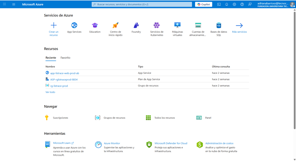

Para crear la aplicación se usó la barra de búsqueda superior escribiendo **"web stati"**. El portal sugirió de inmediato el servicio **Static Web Apps**.

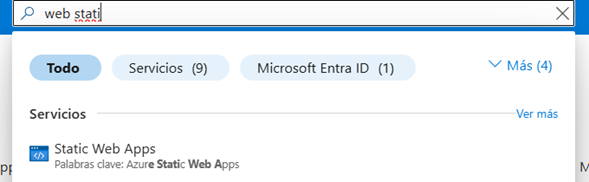

Al entrar al servicio se mostró la vista **Static Web Apps** vacía (ninguna aplicación creada aún). Se pulsó el botón **+ Crear** para iniciar el asistente.

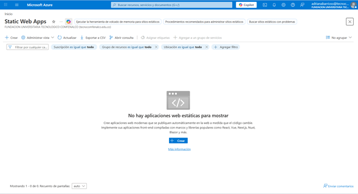

---

## 4. Creación del recurso Static Web App

### 4.1. Pestaña *Datos básicos*

En el formulario **Crear una aplicación web estática** se configuraron los siguientes campos:

- **Suscripción:** `Azure for Students`
- **Grupo de recursos:** `produccion` (creado nuevo con la opción **Crear nuevo**)


- **Nombre de la aplicación web estática:** `produ-PokeDex`


- **Plan de hospedaje → Tipo de plan:** `Gratis: para aficiones o proyectos personales`

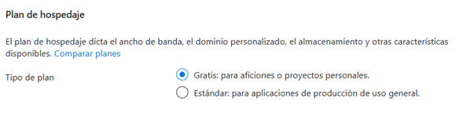

### 4.2. Detalles de implementación — GitHub

En la misma pestaña *Datos básicos*, sección **Detalles de la implementación**, se seleccionó:

- **Origen:** `GitHub`
- **Cuenta de GitHub:** `barriosadriana`

Azure solicitó autorización en GitHub para leer repositorios y crear el workflow de GitHub Actions. Se autorizó la aplicación **Azure App Service Creates** concediendo acceso a repositorios públicos y privados y la capacidad de actualizar archivos de workflow.

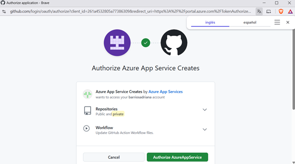

Una vez autorizada la cuenta, se seleccionaron la organización, repositorio y rama:

- **Organización:** `barriosadriana`
- **Repositorio:** `PokeDex`
- **Rama:** `main`

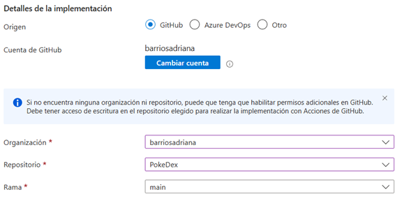

### 4.3. Detalles de la compilación (Build Details)

Azure detectó automáticamente el framework del proyecto y permitió ajustar las rutas del build:

- **Valores preestablecidos de compilación:** `Angular (detectado)`
- **Ubicación de la aplicación:** `/`
- **Ubicación de la API:** *(vacío)*
- **Ubicación de salida:** `dist/pokedex-angular`

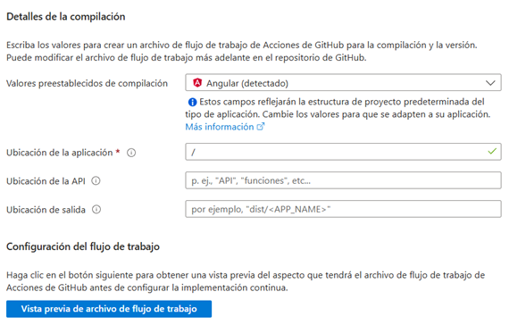

Estos valores se utilizan para generar el archivo de workflow de GitHub Actions que compilará la aplicación y publicará el contenido del directorio de salida.

### 4.4. Pestaña *Configuración de la implementación*

En esta pestaña se define cómo se autentica el workflow de GitHub contra Azure para publicar los artefactos. Las dos opciones disponibles son:

- **Token de implementación**: Azure genera un secreto y lo inyecta en el repositorio.

  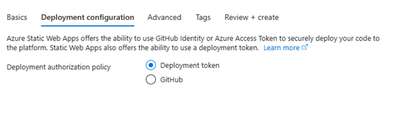

- **GitHub (OIDC)**: Azure confía directamente en la identidad de GitHub Actions a través de OpenID Connect, sin necesidad de rotar un token.

  Se seleccionó **Token de implementación** como directiva de autorización final para el despliegue.

  

### 4.5. Pestaña *Avanzados*

- **Región para la API y los entornos de ensayo de Azure Functions:** `East US 2`
- **Perímetro de nivel empresarial:** *deshabilitado* (requiere plan Standard).

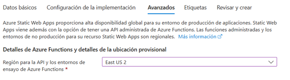

### 4.6. Pestaña *Revisar y crear*

Se validó el resumen completo y se presionó **Crear**:

- **Suscripción:** `f2cd2194-0c46-4278-b716-5e47a8cadb91`
- **Grupo de recursos:** `produccion`
- **Nombre:** `produ-PokeDex`
- **Región:** `eastus2`
- **SKU:** `Free`
- **Repositorio:** `https://github.com/barriosadriana/PokeDex`
- **Rama:** `main`
- **Ubicación de la aplicación:** `/`
- **Ubicación de la API:** *(vacío)*
- **Ubicación de salida:** `dist/pokedex-angular`
- **Directiva de autorización de implementación:** `GitHub`

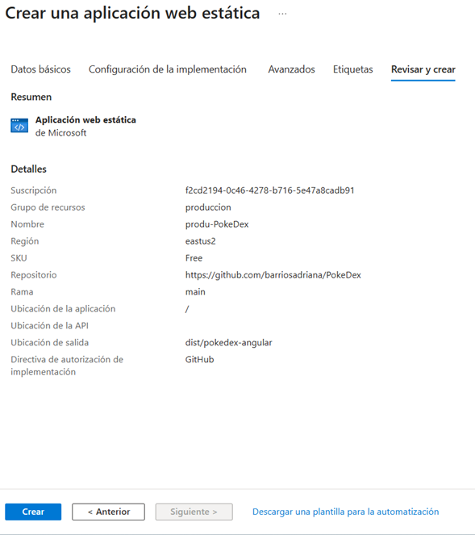

---

## 5. Implementación en curso y recurso creado

Al pulsar **Crear**, Azure inició el proceso de provisión del Static Web App.

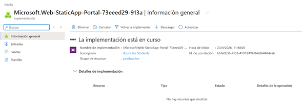

Minutos después el proceso terminó correctamente. Azure mostró la pantalla **Se completó la implementación**, con el botón **Ir al recurso** para abrir directamente la nueva aplicación.

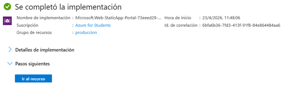

### 5.1. Vista *Overview* del recurso

Se redirigió a la vista **Información general** del recurso `produ-PokeDex`, mostrando:

- **Grupo de recursos:** `produccion`
- **Suscripción:** `Azure for Students`
- **Id. de suscripción:** `f2cd2194-0c46-4278-b716-5e47a8cadb91`
- **Ubicación:** `Global`
- **SKU:** `Free`
- **Dirección URL pública:** `https://gentle-meadow-0d58dab0f.7.azurestaticapps.net`
- **Origen:** `main` (GitHub)
- Enlace al **workflow** `azure-static-web-apps-gentle-meadow-0d58dab0f.yml` generado automáticamente en GitHub Actions.


---

## 6. Integración continua con GitHub Actions

Azure creó y commiteó de forma automática el archivo de workflow en la rama `main` del repositorio:

- Ruta: `.github/workflows/azure-static-web-apps-gentle-meadow-0d58dab0f.yml`


### 6.1. Ejecución del workflow

Tras el primer commit del workflow, GitHub Actions ejecutó el pipeline **"ci: add Azure Static Web Apps workflow file"** con los siguientes jobs:

1. **Set up job**
2. **Build Azure/static-web-apps-deploy@v1**
3. **Run actions/checkout@v3**
4. **Install OIDC Client from Core Package**
5. **Get Id Token**
6. **Build And Deploy**
7. **Post Run actions/checkout@v3**

Desde la pestaña **Historial de implementación** del recurso se puede verificar el run y acceder al detalle en GitHub.

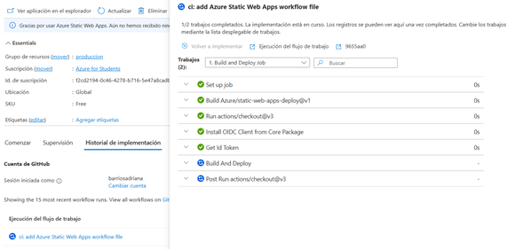

Al finalizar el run el recurso quedó totalmente aprovisionado y la app publicada. La vista **Información general** confirmó el estado **Listo** y el dominio en producción.

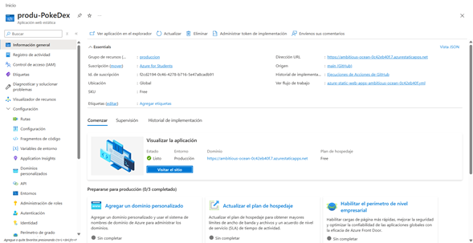

---

## 7. Configuración adicional del sitio (`staticwebapp.config.json`)

En la raíz del proyecto se encuentra el archivo `staticwebapp.config.json`. Azure Static Web Apps lo detecta de forma automática al servir el sitio y aplica las reglas definidas en él. Este archivo es **clave** para el despliegue porque resuelve dos problemas:

1. Que las imágenes y assets se sirvan correctamente aunque el build original estuviera pensado para GitHub Pages (`base-href=/pokedex-angular/`).
2. Reforzar la seguridad de la aplicación en producción con cabeceras HTTP.

Contenido del archivo:

```json
{
  "routes": [
    {
      "route": "/pokedex-angular/assets/*",
      "rewrite": "/assets/{wildcard}"
    }
  ],
  "globalHeaders": {
    "Content-Security-Policy": "default-src 'self'; script-src 'self'; style-src 'self' 'unsafe-inline' https://fonts.googleapis.com; font-src 'self' https://fonts.gstatic.com; img-src 'self' data: https: blob:; frame-ancestors 'none'; connect-src 'self' https://beta.pokeapi.co https://pokeapi.co https://*.pokeapi.co",
    "Strict-Transport-Security": "max-age=31536000; includeSubDomains; preload",
    "X-Content-Type-Options": "nosniff",
    "X-Frame-Options": "DENY",
    "Referrer-Policy": "no-referrer",
    "Permissions-Policy": "geolocation=(), microphone=(), camera=()"
  }
}
```

### 7.1. Sección `routes` — Rewrite de assets

```json
"routes": [
  {
    "route": "/pokedex-angular/assets/*",
    "rewrite": "/assets/{wildcard}"
  }
]
```

- **`route`**: patrón que Azure intercepta. Cualquier solicitud entrante cuya URL comience con `/pokedex-angular/assets/` será capturada por esta regla. El `*` actúa como comodín y se guarda en la variable `{wildcard}`.
- **`rewrite`**: URL interna real que Azure sirve. La petición se **reescribe** (no se redirige, la URL en el navegador no cambia) a `/assets/<lo-que-coincidió>`, que es donde realmente se publican los archivos dentro de `dist/pokedex-angular` tras el build de Angular.
- **¿Por qué se necesita?** El proyecto se construyó originalmente para publicarse en GitHub Pages bajo el sub‑path `/pokedex-angular/`. Algunas rutas del código y plantillas aún referencian `/pokedex-angular/assets/...`. En Azure Static Web Apps el sitio se sirve desde la raíz (`/`), por lo que sin esta regla esas solicitudes devolverían `404`. El rewrite permite que las URLs antiguas sigan funcionando sin tener que reescribir el código fuente.

### 7.2. Sección `globalHeaders` — Cabeceras de seguridad

Azure agrega cada una de estas cabeceras a **todas** las respuestas HTTP del sitio:

- **`Content-Security-Policy` (CSP)**: define qué orígenes pueden cargar recursos. Se listan explícitamente los dominios permitidos:
  - `default-src 'self'` → por defecto solo se permite contenido del propio dominio.
  - `script-src 'self'` → JavaScript solo desde el mismo origen (sin inline ni CDNs externos).
  - `style-src 'self' 'unsafe-inline' https://fonts.googleapis.com` → CSS propio, estilos inline (requerido por Angular) y Google Fonts.
  - `font-src 'self' https://fonts.gstatic.com` → fuentes propias y de Google Fonts.
  - `img-src 'self' data: https: blob:` → imágenes locales, base64, cualquier HTTPS y blobs (necesario porque los sprites de Pokémon se cargan desde dominios de GitHub/PokeAPI).
  - `frame-ancestors 'none'` → el sitio no puede ser embebido en iframes.
  - `connect-src 'self' https://beta.pokeapi.co https://pokeapi.co https://*.pokeapi.co` → las llamadas AJAX/GraphQL solo pueden ir a la propia app y a los endpoints de PokeAPI. Si se omite `pokeapi.co`, la CSP bloquearía las consultas y la PokeDex aparecería vacía.
- **`Strict-Transport-Security: max-age=31536000; includeSubDomains; preload`**: fuerza HTTPS durante un año, incluyendo subdominios.
- **`X-Content-Type-Options: nosniff`**: impide que el navegador deduzca el tipo MIME e interprete archivos como scripts por error.
- **`X-Frame-Options: DENY`**: refuerzo clásico (junto con `frame-ancestors`) para impedir clickjacking.
- **`Referrer-Policy: no-referrer`**: no envía la cabecera `Referer` al navegar fuera del sitio, protegiendo la privacidad.
- **`Permissions-Policy: geolocation=(), microphone=(), camera=()`**: deshabilita explícitamente APIs del navegador que la app no necesita.

> Nota: este archivo se copia tal cual desde la raíz al artefacto publicado (Azure lo busca tanto en la raíz del repo como dentro del `output_location`). No requiere pasos adicionales en el pipeline.

---

## 8. Ajuste en `environment.prod.ts` para que Azure encuentre las imágenes

El proyecto original estaba preparado para publicarse en **GitHub Pages** bajo la ruta `https://<usuario>.github.io/pokedex-angular/`. Por eso el `environment.prod.ts` tenía el `imagesPath` apuntando al sub‑path `/pokedex-angular/`:

```ts
// Versión original (GitHub Pages)
imagesPath: '/pokedex-angular/assets/images',
```

En **Azure Static Web Apps** el sitio se sirve desde la raíz del dominio (`https://gentle-meadow-0d58dab0f.7.azurestaticapps.net/`), por lo que esa ruta quedaba **rota**: el navegador pedía `/pokedex-angular/assets/images/...` y Azure respondía `404` porque ese prefijo no existe en el despliegue. En el sitio esto se traducía en que los sprites y la mayoría de íconos de Pokémon no aparecían.

La corrección fue apuntar el path a la raíz de los assets tal como los publica el build de Angular:

```ts
// src/environments/environment.prod.ts
export const environment = {
  production: true,
  pokeApi: 'https://pokeapi.co/api/v2',
  pokeApiGraphQL: 'https://beta.pokeapi.co/graphql/v1beta',
  homeAngular: 'https://angular.io/',
  homePokeApi: 'https://pokeapi.co/',
  keilerLinkedin: 'https://www.linkedin.com/in/keilermora/',
  pokedexGithub: 'https://github.com/keilermora/pokedex-angular',
  imagesPath: '/assets/images',
  language: 'en',
  languageId: 9,
};
```

**¿Por qué funciona con `/assets/images`?**

- El build `ng build` copia la carpeta `src/assets` a `dist/pokedex-angular/assets` (definido en `angular.json`).
- Azure publica el contenido de `dist/pokedex-angular` como raíz del sitio, por lo que la carpeta queda accesible en `https://.../assets/images/...`.
- Al comenzar con `/`, la ruta es **absoluta desde el dominio**, evitando problemas si el componente que la usa se navega desde rutas anidadas.

**Relación con `staticwebapp.config.json`:** el rewrite de la sección 7.1 atrapa las peticiones heredadas (`/pokedex-angular/assets/*`) que puedan quedar en plantillas/imports, mientras que este cambio en `environment.prod.ts` corrige las rutas que el código construye dinámicamente a partir de `environment.imagesPath`. Los dos ajustes juntos garantizan que **todas** las imágenes carguen correctamente en Azure.

---

## 9. Verificación del sitio publicado

Una vez completado el workflow se accedió a la URL generada por Azure:

- `https://gentle-meadow-0d58dab0f.7.azurestaticapps.net`

La aplicación **PokeDex** cargó correctamente mostrando los 151 Pokémon de primera generación con la barra superior (**HOME**, **ABOUT**), el selector de versión (Green → Emerald), el filtro por nombre y el ordenamiento por número.

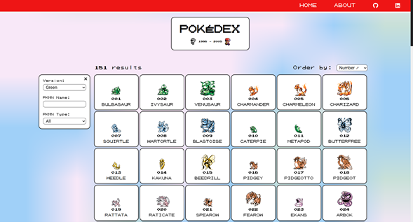


Con esto la aplicación queda desplegada en Azure con CI/CD activo: cada push a `main` reconstruye y republica el sitio automáticamente.
