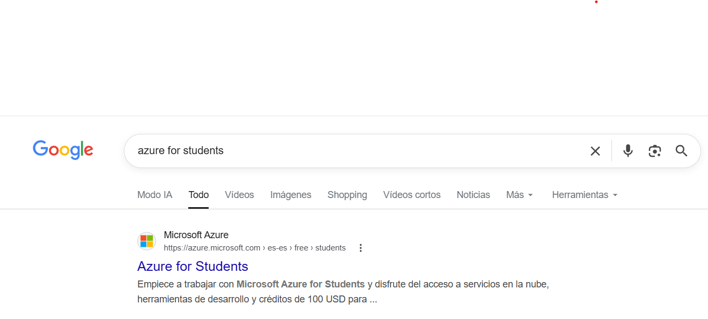
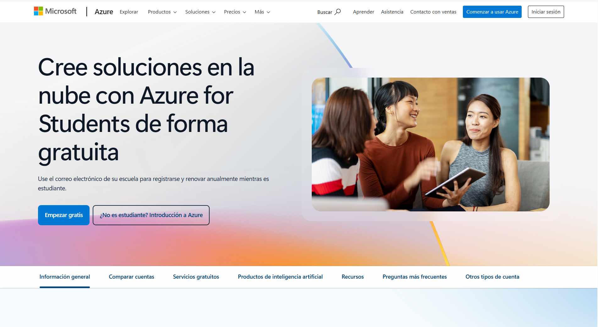

# Pokédex Angular

[](https://github.com/prettier/prettier)
[](https://codecov.io/gh/keilermora/pokedex-angular)
[](http://commitizen.github.io/cz-cli/)

[https://keilermora.github.io/pokedex-angular/](https://keilermora.github.io/pokedex-angular/)

La aplicación muestra el listado y el detalle de los Pokémon de las primeras 3 generaciones.

La imagen que representa un Pokémon en el listado muestra las variaciones que estos tuvieron durante las primeras versiones, desde la versión Green (1996) hasta la version Emerald (2005).

Los detalles de un Pokémon individual muestra sus estadísticas base y los registros de la Pokédex de las diferentes versiones.

El proyecto fue desarrollado usando la librería de JavaScript [Angular](https://angular.io/) para crear la interfaz de usuario, en comunicación con la Api RESTful [PokéAPI](https://pokeapi.co/).

## Requisitos mínimos

- [Nodejs](https://nodejs.org) con soporte de largo plazo (LTS).
- Un navegador web

## Ambiente de pruebas

Ejecutar en la raíz del proyecto:

```
npm start
```

## Referencias

- [Angular](https://angular.io/): One framework.
- [Angular Folder Structure](https://angular-folder-structure.readthedocs.io/en/latest/): Create a skeleton structure which is flexible for projects big or small.
- [Font Awesome](https://fontawesome.com/): The web's most popular icon set and toolkit.
- [Normalize.css](https://necolas.github.io/normalize.css/): A modern, HTML5-ready alternative to CSS resets.
- [PokéAPI](https://pokeapi.co/): The RESTful Pokémon API.


# Creación de la cuenta en la nube — Microsoft Azure for Students

Ahora Describiremos el paso a paso del proceso que se realizó para crear la cuenta en **Microsoft Azure** utilizando el programa **Azure for Students**, que permite a estudiantes acceder de forma **gratuita** a servicios de Azure sin necesidad de tarjeta de crédito.

---

## 1. ¿Por qué Azure for Students?

Se eligió **Microsoft Azure** como proveedor de nube para este proyecto por las siguientes razones:

- **Crédito gratuito de 100 USD** por 12 meses, renovables mientras se mantenga la condición de estudiante.
- **No requiere tarjeta de crédito** para la activación; basta con un correo institucional válido.
- Incluye acceso a servicios populares gratuitos como **Static Web Apps**, **App Service (F1)**, **Azure SQL**, **Functions**, entre otros, que permiten desplegar aplicaciones reales sin costo.
- Integración nativa con **GitHub** para CI/CD, lo cual se aprovechó posteriormente para el despliegue de la aplicación PokeDex.

---

## 2. Requisitos previos

Antes de iniciar el registro se verificó contar con:

- **Correo institucional** activo (en este caso `jhojamcaraballot@tecnocomfenalco.edu.co`, del dominio educativo `@tecnocomfenalco.edu.co`).
- **Acceso a internet** y un navegador actualizado (Google Chrome).
- **Número de teléfono móvil** para la verificación por SMS.
- Datos personales básicos (nombre, fecha de nacimiento, país/región).

> **Importante:** Microsoft valida automáticamente el correo contra la lista de instituciones educativas reconocidas. Si el dominio no está verificado no te aprobara los creditos gratuitos y negara la solicitud.).

---

## 3. Búsqueda del programa Azure for Students

Se abrió el navegador y se realizó la búsqueda **"azure for students"** en Google. El primer resultado oficial corresponde al dominio `azure.microsoft.com`, sección `/free/students`, con la descripción:

> *"Empiece a trabajar con Microsoft Azure for Students y disfrute del acceso a servicios en la nube, herramientas de desarrollo y créditos de 100 USD para..."*



Se hizo clic en el enlace oficial de Microsoft para acceder a la landing page del programa.

---

## 4. Inicio del registro desde la página oficial

El enlace redirigió a la página de promoción de **Azure for Students**:

> *"Cree soluciones en la nube con Azure for Students de forma gratuita — Use el correo electrónico de su escuela para registrarse y renovar anualmente mientras es estudiante."*

Opciones presentadas:

- **Empezar gratis** → botón principal que inicia el flujo de registro con correo institucional.
- **¿No es estudiante? Introducción a Azure** → alternativa estándar (no se usó).



Se hizo clic en **Empezar gratis** para continuar.

---

## 5. Flujo de registro e inicio de sesión

Al pulsar **Empezar gratis** Microsoft solicita:

1. **Correo institucional** — se ingresó `adrianabarrioss@tecnocomfenalco.edu.co`.
2. **Contraseña** asociada a la cuenta Microsoft del correo institucional (si la institución usa Microsoft 365, la contraseña es la misma del correo; de lo contrario, se crea una nueva).
3. **Verificación de identidad** mediante código enviado por SMS al número de teléfono registrado.
4. **Aceptación del contrato de suscripción** de Azure for Students y la política de privacidad.
5. **Datos del perfil estudiantil**: nombre completo, país/región, fecha de nacimiento e institución educativa.

Microsoft verifica automáticamente que el dominio `@tecnocomfenalco.edu.co` esté en su base de instituciones reconocidas. Al ser un dominio educativo válido, la verificación fue aprobada de forma inmediata y se activó el **crédito de 100 USD** junto con los servicios gratuitos del plan.

---

## 6. Acceso al portal de Azure

Una vez completado el registro, se accedió a `https://portal.azure.com` e inició sesión con la cuenta recién creada. El portal cargó mostrando la cuenta activa en la esquina superior derecha:

- **Usuario autenticado:** `adrianabarrioss@tecnocomfenalco.edu.co`
- **Idioma:** Español
- **Tenant:** Tecnológico Comfenalco (institución educativa vinculada al dominio)

Con la sesión iniciada quedó disponible la suscripción **Azure for Students** para crear recursos (grupos de recursos, Static Web Apps, App Services, etc.) consumiendo el crédito gratuito.

---

## 7. Verificación de la suscripción

Para confirmar que la suscripción estudiantil quedó activa correctamente se revisó:

1. Menú **Suscripciones** en el portal → debe listar una suscripción llamada **"Azure for Students"**.
2. Dentro de la suscripción, sección **Información general** → muestra el crédito disponible (100 USD) y la fecha de expiración (12 meses desde la activación).
3. Menú **Centro de costos / Gestión de costos** → permite monitorear el consumo del crédito.

---
